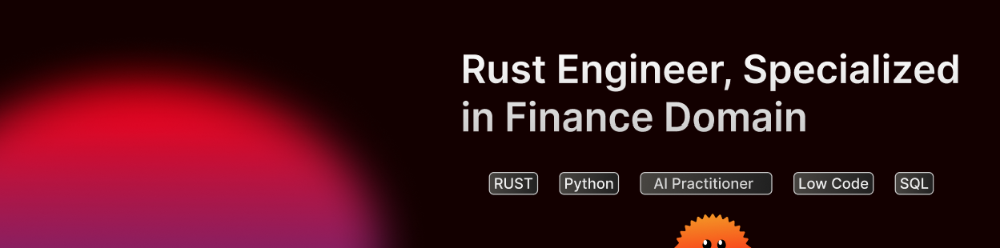

<h2>Hi, I'm Arik 👋</h2>

  
  
  

<!-- Replace with your own bio -->
Technical lead with 12 years of experience in driving large-scale platform migrations in regulated environments (banking, healthcare, government) and managing engineering teams. Early-career .NET and C# background provides direct grounding in the object-oriented architectural patterns that underpin legacy C# codebases targeted for migration. Actively developing production-ready Rust skills built multiple projects in Axum, Tokio, SQLx, Leptos, and PostgreSQL, with hands-on command of ownership, lifetimes, async/await, and Cargo tooling; built a Docker-based deployment pipeline (multi-stage builds, nginx reverse proxy, scripted prod releases, GitHub Actions CI) to ship Rust services with zero-downtime guarantees at scale. Holds an Executive MBA from IESE Business School (Barcelona, FT top 10), enabling clear articulation of technical roadmaps to senior stakeholders.

<h2 align="center">Some of my favorite projects</h2>
 

  <!-- Replace owner/repo with your own pinned repos -->
  
  

<h2 align="center">About me 🚀</h2>

<b>Timezone: Europe/Paris (CET)</b>

<!-- Edit each line below to match your work -->
In my latest project, I built www.rustfinance.com, a full-stack retail banking app built with async Rust (Axum + Tokio) + TypeScript (TanStack Start). Already deployed in production.
 
🔸 Currently maintaining: <a href="https://www.rustfinance.com">www.rustfinance.com</a> 
🔸 Specialty: Rust backend & fullstack — REST APIs, async Rust, WASM, service-oriented architecture, BPM, process automation, Python 
🔸 Finance: built a KYC mobile application for a Dutch bank 
🔸 Looking to collaborate on: production Rust projects, backend systems, low-code tooling, Python and AI models 
🔸 Ask me about: Rust fullstack & backend architecture, BPM process automation, Python 
🔸 Interested in Web3, Blockchain & Solana
 

<h2 align="center">⚒️ Languages-Frameworks-Tools ⚒️</h2>
 

    <!-- Edit the i= list: see https://github.com/tandpfun/skill-icons for codes -->
    
   
     

 

 <picture>
  <source
    media="(prefers-color-scheme: dark)"
    srcset="https://raw.githubusercontent.com/arikdutta/arikdutta/output/github-snake-dark.svg"
  />
  <source
    media="(prefers-color-scheme: light)"
    srcset="https://raw.githubusercontent.com/arikdutta/arikdutta/output/github-snake.svg"
  />
  
</picture>

 
 

  

 
